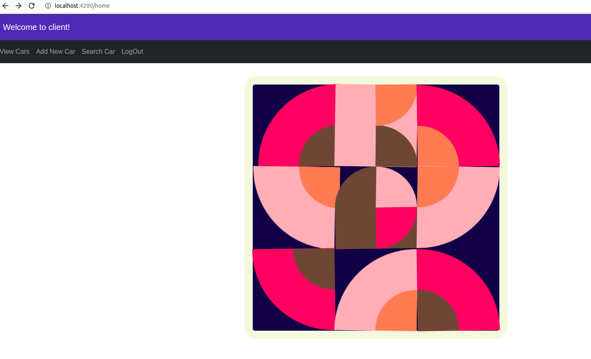

== Angular + Spring Boot Application

=== Spring Boot Server

. start.spring.io: JPA, H2, Rest Repositories, Lombok, Web, and Actuator

  http https://start.spring.io/starter.zip dependencies==h2,data-jpa,data-rest,lombok,web,devtools,actuator -d

    git clone https://github.com/MehmedMazlum/spring-boot-angular.git
    cd server/

. Start in console: `./mvnw spring-boot:run`

. You can Login Page with one of the 3 users given below  - >  http://localhost:4200

. After login Page : A page like the following will come up.

    .You can view cars list , add new car and search car in the Headers

    .Users and city.csv file will be loaded automatically at boot up and There is no need to make any settings for this

. There are 3 user

    mami -> (username : mami , password :1 ) has role to read list car , search a car and hasn't right to add a car.

    john -> (username : john , password :1 ) has role  to read list car , add new car  and hasn't right search a car.

    sarah -> (username : sarah , password :1 ) has role admin and  can anything.

=== Angular App Client

. Run `ng new client`; show app with `npm start`

        git clone https://github.com/MehmedMazlum/spring-boot-angular.git

    install bootstrap pproperly in this path
    # 👇️ with NPM
    npm install bootstrap
    # 👇️ ONLY If you use TypeScript
    npm install --save-dev @types/bootstrap
    # ----------------------------------------------
    # 👇️ with YARN
    yarn add bootstrap
    # 👇️ ONLY If you use TypeScript
    yarn add @types/bootstrap --dev
    -----------------------------------------------
    start client
    cd client/

    Start in console:
    npm install && npm start
